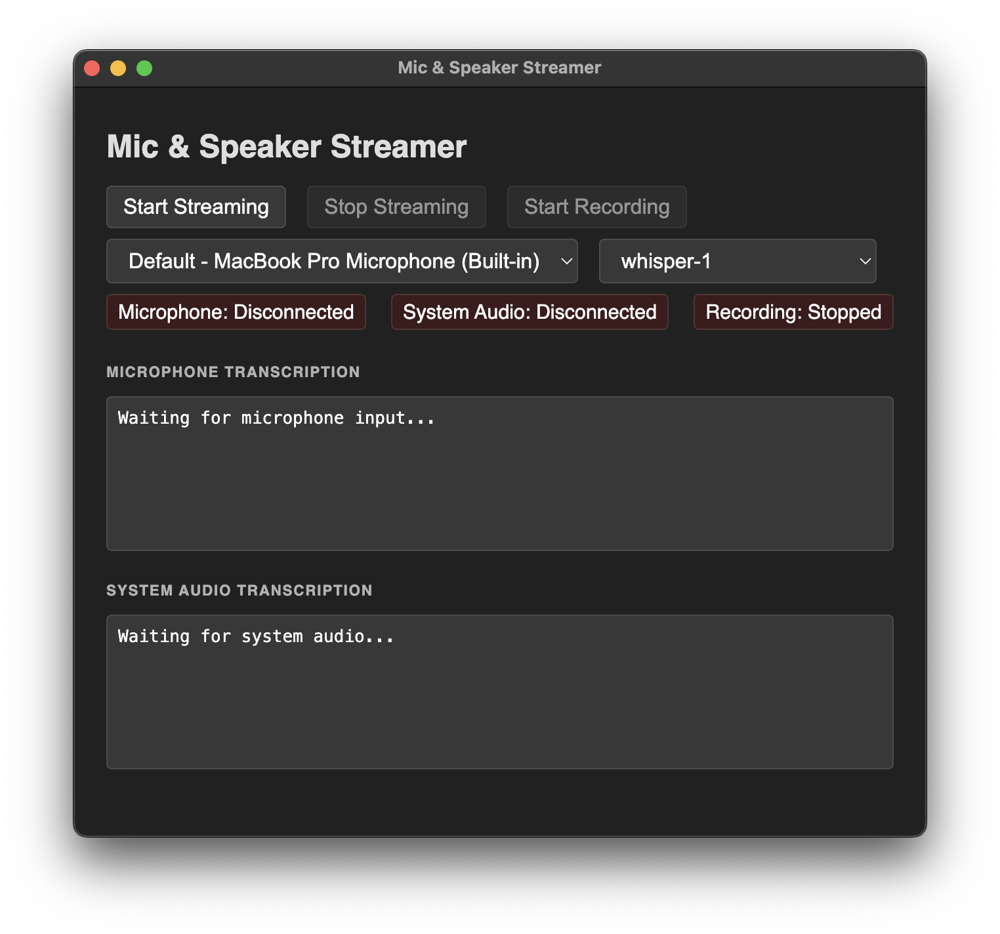
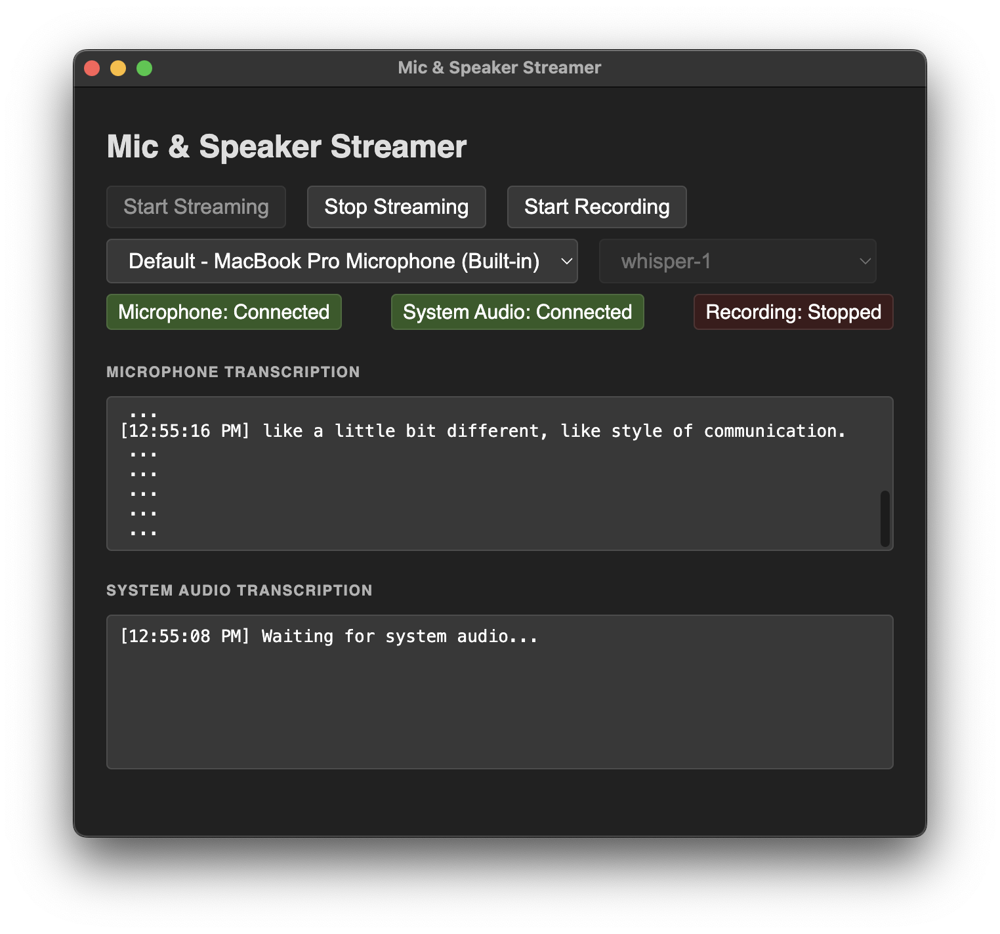

# Mic & Speaker Streamer

An example Electron application that streams microphone and system audio to OpenAI's Realtime API for real-time transcription. The app provides a simple interface to capture both microphone input and system audio output, transcribe them in real-time, and optionally record the combined audio as WAV files.

This provides a starting point for building a desktop application that streams microphone and system audio to OpenAI's Realtime API for real-time transcription. See [electron-audio-loopback](https://github.com/alectrocute/electron-audio-loopback) for more information on how to capture system audio.




## Features

- **Real-time Transcription**: Stream microphone and system audio to OpenAI's Realtime API
- **Dual Audio Capture**: Simultaneously capture microphone input and system audio output
- **Multiple Model Support**: Choose from different OpenAI transcription models:
  - `whisper-1`
  - `gpt-4o-transcribe`
  - `gpt-4o-mini-transcribe`
- **Audio Recording**: Record combined microphone and system audio as WAV files
- **Modern UI**: Clean, dark-themed interface with real-time status indicators
- **Cross-platform**: Works on macOS, Windows, and Linux

## Prerequisites

- Node.js (v16 or higher)
- OpenAI API key with access to Realtime API
- Microphone and speakers/audio output device

## Installation

1. Clone or download this repository
2. Install dependencies:
   ```bash
   npm install
   ```

3. Create a `.env` file in the project root and add your OpenAI API key:
   ```
   OPENAI_KEY=your_openai_api_key_here
   ```

## Usage

1. Start the application:
   ```bash
   npm start
   ```

2. The app window will open with controls for:
   - **Start Streaming**: Begin capturing and transcribing audio
   - **Stop Streaming**: Stop audio capture and transcription
   - **Start Recording**: Begin recording combined audio as WAV file
   - **Microphone Select**: Choose input device
   - **Model Select**: Choose transcription model

3. Status indicators show connection state for:
   - Microphone input
   - System audio output
   - Recording status

4. Real-time transcription results appear in separate panels for microphone and system audio

## Technical Details

### Architecture

- **Main Process** (`main.js`): Electron main process with audio loopback initialization
- **Renderer Process** (`renderer.js`): Frontend logic for audio capture and API communication
- **Preload Script** (`preload.js`): Secure bridge between main and renderer processes

### Key Components

- **Session Class**: Manages WebRTC connections to OpenAI Realtime API
- **WavRecorder Class**: Handles audio recording and WAV file generation
- **Audio Loopback**: Uses `electron-audio-loopback` for system audio capture

### Dependencies

- `electron`: Desktop application framework
- `electron-audio-loopback`: System audio capture
- `dotenv`: Environment variable management

## API Requirements

This application requires an OpenAI API key with access to the Realtime API. The Realtime API is currently in beta and may require special access.

## Troubleshooting

- **No audio detected**: Ensure microphone permissions are granted to the application
- **System audio not captured**: On macOS, grant microphone permissions in System Preferences
- **API errors**: Verify your OpenAI API key is valid and has Realtime API access

## License

This project is provided as-is for educational and development purposes. Go crazy.

## Author

Alec Armbruster [@alectrocute](https://github.com/alectrocute)